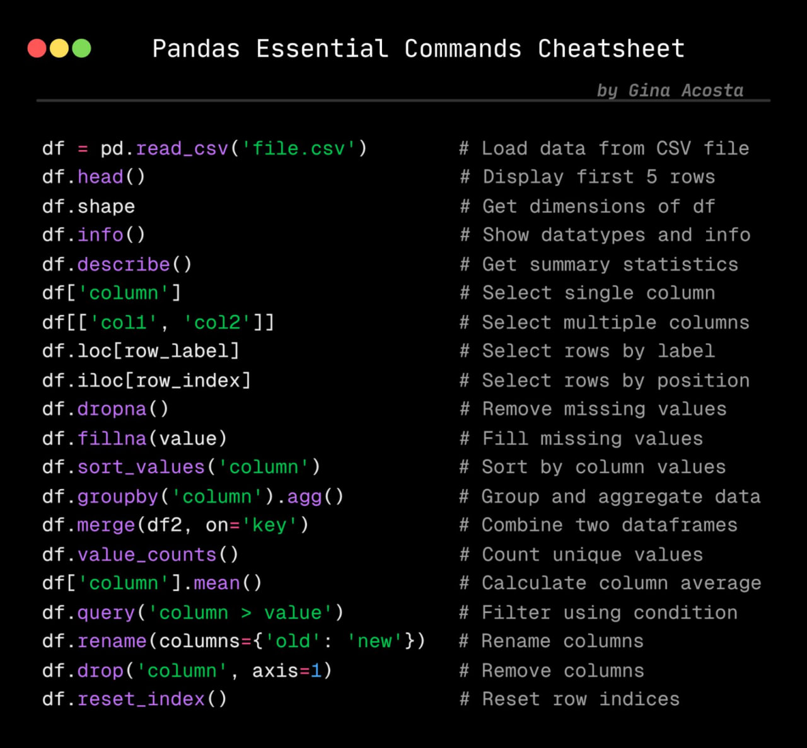

# CSC3105 - Data Analytics

## Installation

To install the required libraries, run the following command:

```
pip install pandas matplotlib numpy scikit-learn seaborn tensorflow
```

## Execution Order

Run the following notebooks in order:

1. DataPrepNLOS.ipynb
2. DataPrepRange.ipynb
3. DataMining.ipynb
4. DataVisualization.ipynb



